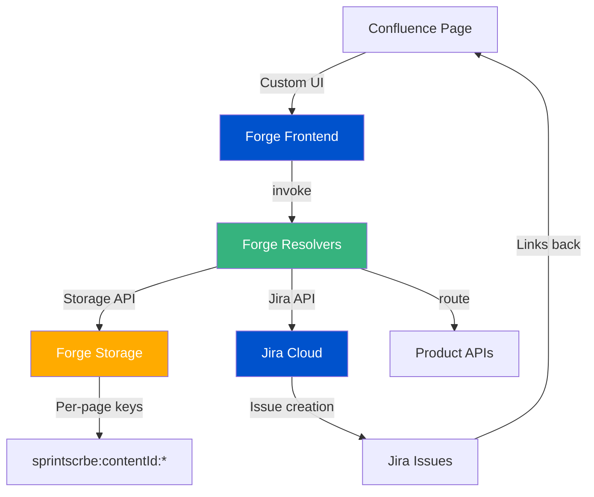

# SprintScribe AI — Pit Crew Console

**SprintScribe AI** is a Forge app for Confluence that transforms meeting transcripts into actionable Jira issues. Think of it as your "pit crew" for meetings—quickly extracting decisions, action items, and insights, then converting them into trackable tasks with full traceability back to the source.

## What SprintScribe AI Does

SprintScribe AI acts as a **pit crew** for your meetings:
- **Real-time processing**: Paste a transcript and instantly extract insights
- **Meeting-to-Jira loop**: Convert action items directly into Jira tasks
- **Per-page persistence**: All data is scoped to individual Confluence pages
- **Confidence scoring**: Action items are tagged with confidence levels (high/medium/low)
- **Full traceability**: Jira issues include source links, meeting summaries, and original transcript lines

## Key Features

### 1. **Transcript Analysis**
- Extracts **suggestions** (insights and recommendations)
- Identifies **decisions** (agreements and conclusions)
- Parses **action items** with owners and due dates
- Confidence scoring based on parsing patterns

### 2. **Meeting Summary Generation**
- Deterministic summary creation from transcript and analysis
- Includes "What was discussed", decisions, and actions
- Persists per Confluence page

### 3. **Jira Integration**
- Create Jira issues directly from action items
- Automatic user assignment (when owner matches Jira user)
- Due date support
- Enriched descriptions with:
  - Source: Confluence page URL
  - Meeting Summary
  - Original transcript line

### 4. **Action Item Quality**
- **Confidence levels**: High (explicit "Action:"), Medium ("will" patterns), Low (inferred)
- **Draft vs Published**: Track which items have been converted to Jira
- **Visual badges**: Color-coded confidence indicators
- **Status labels**: Clear Draft/Published states with issue keys

### 5. **Per-Page Persistence**
- Session state (IDLE/RUNNING) per Confluence page
- Transcript auto-save (debounced 500ms)
- Analysis results persist across page refreshes
- Created issue keys tracked per page
- Meeting summaries stored per page

### 6. **Demo Mode**
- Pre-loaded demo transcripts (Sprint Planning, Bug Triage, Stakeholder Review)
- One-click loading for quick demos
- Reset Meeting button for repeatable demos

## Demo Steps

**6-Step Demo Flow:**

1. **Start Session** → Click "Start Session" to enable transcript input
2. **Load/Paste Transcript** → Use demo scenarios or paste your own transcript
3. **Analyze** → Click "Analyze" to extract suggestions, decisions, and action items
4. **Generate Summary** → Click "Generate Summary" to create meeting summary
5. **Create Jira Issues** → Select action items, choose Jira project, click "Create Jira Issues"
6. **Verify Persistence** → Refresh page to confirm all data persists per-page

## Architecture



## Tech Stack

- **Platform**: Atlassian Forge Cloud
- **Frontend**: React (via @forge/react UI Kit)
- **Backend**: Node.js 24.x (Forge Functions)
- **Storage**: Forge Storage API (per-page scoped)
- **APIs**: 
  - Jira REST API (via `route` template literals)
  - Confluence Context API
- **Build**: Vite (for Custom UI)

## Project Structure

```
sprintscrbe-ai/
├── src/
│   └── index.js              # Backend resolvers
├── static/
│   ├── hello-world/          # Main macro Custom UI
│   │   └── src/
│   │       └── App.jsx       # Frontend React app
│   └── config/               # Macro configuration UI
├── manifest.yml              # Forge app manifest
└── README.md                 # This file
```

## Requirements

- Node.js 18+ (Forge CLI requirements)
- Atlassian Forge CLI installed (`npm install -g @forge/cli`)
- Atlassian Cloud site (Jira + Confluence)
- Forge account with app registered

## Quick Start

### 1. Install Dependencies

```bash
npm install
```

### 2. Build the App

```bash
npm run build
```

### 3. Deploy to Development

```bash
forge deploy --non-interactive --e development
```

### 4. Install on Your Site

```bash
forge install --non-interactive --site <your-site-url> --product jira --environment development
```

**Note**: The app requires both Jira and Confluence to be installed on the same site.

### 5. Use in Confluence

1. Edit any Confluence page
2. Insert the "SprintScribe AI" macro
3. Publish the page
4. Start using the Pit Crew Console!

## Development

### Build

```bash
npm run build
```

### Lint

```bash
forge lint
```

### Deploy

```bash
forge deploy --non-interactive --e development
```

### Tunneling (for local development)

```bash
forge tunnel
```

**Note**: When using tunnel, you must redeploy if you change `manifest.yml`. Code changes are hot-reloaded automatically.

## Storage Keys

All data is stored per Confluence page using `contentId`-scoped keys:

- `sprintscrbe:${contentId}:session` - Session state (IDLE/RUNNING)
- `sprintscrbe:${contentId}:analysis` - Analysis results (suggestions, decisions, actionItems)
- `sprintscrbe:${contentId}:meeting` - Meeting state (transcript, summary, createdIssueKeys, updatedAt)
- `sprintscrbe:${contentId}:createdIssues` - Created Jira issues (array of {key, url})

## Permissions & Scopes

The app requires the following Forge scopes:

- `storage:app` - Store per-page data
- `read:jira-work` - Read Jira projects and issues
- `write:jira-work` - Create Jira issues and comments
- `read:jira-user` - Search for Jira users (for assignment)

## Limitations

### Current Limitations

- **Deterministic parsing**: Uses regex-based extraction, not AI/ML models
- **Transcript input only**: Requires manual paste of transcript text
- **No live meeting integration**: Future work to integrate with meeting platforms
- **Single project selection**: Creates issues in one Jira project at a time
- **User matching**: Owner assignment relies on Jira user search (display name or email)

### Future Enhancements

- AI/ML-based extraction for improved accuracy
- Live meeting platform integrations (Zoom, Teams, etc.)
- Multi-project issue creation
- Advanced user matching and suggestions
- Export capabilities (CSV, PDF)
- Meeting templates and presets

## Demo Transcripts

See [`/docs/demo.md`](./docs/demo.md) for pre-configured demo transcripts and validation checklists.

## Support

For issues, questions, or contributions, please refer to the project repository.

## License

See [LICENSE](./LICENSE) for details.
